# rydberg-parameter-lab

**From Lindblad dynamics → structured rate processes → universal scaling laws**

---

## Key Results

- Emergence of an **effective noise coordinate**  
  γ_eff = γ + λ·γ_φ  

- Identification of a **controlled breakdown of 1D scaling**

- Recovery via a **low-dimensional (2D) model**

- Discovery of a **scale-dependent decay rate Γ_eff(x)**

- Derivation of **stretched-exponential universality**

- Identification of a **local exponent field**  
  b_local(x) = x Γ(x) / ∫₀ˣ Γ(u)

- Final result: **global exponent as projection**
  
  b ≈ ∫ w(x) b_local(x) dx  

---

## Overview

This project studies **noise-affected Rydberg CZ gates** and reveals hidden structure in open-system quantum dynamics.

Core shift:

> Dynamics are governed by a **structured, scale-dependent rate process Γ(x)**,  
> not a constant decay rate.

---

## Emergent Effective Noise Coordinate

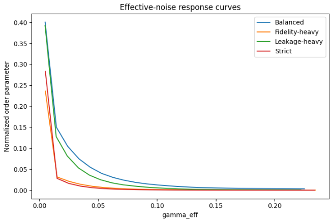

γ_eff = γ + λ·γ_φ  

- Defines dominant noise direction  
- Enables approximate dimensionality reduction  

---

## Breakdown of 1D Scaling

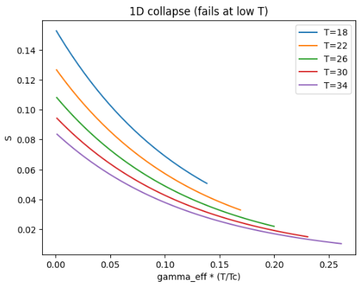

- Alignment fails systematically  
- Deviations are structured, not noise  

---

## Low-Dimensional Model Recovery

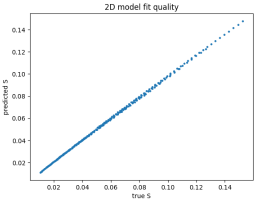

- Near-perfect prediction  
- System is low-dimensional, but not strictly 1D  

---

## Emergent Scale-Dependent Rate

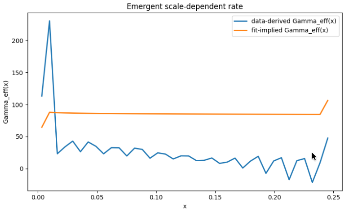

dS/dx = −Γ_eff(x) · S  

- Γ_eff(x) varies strongly across scale  
- Encodes the true dynamics  

---

## Stretched-Exponential Universal Law

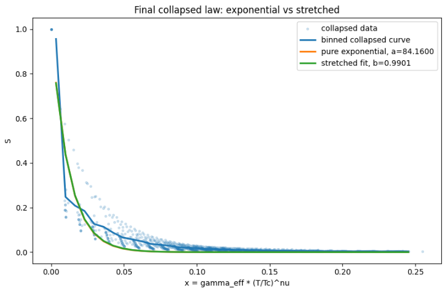

S(x) ≈ exp(−a x^b)

- Pure exponential fails  
- Stretched exponential captures full behavior  
- Exponent b varies across protocols  

---

## Functional Universality

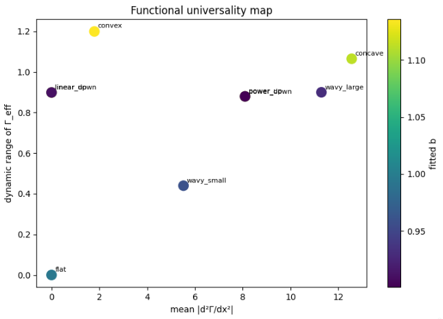

b = Functional[Γ_eff(x)]

- Scalar summaries (CV) are insufficient  
- Full structure determines behavior  

---

## Learned Universality Mapping

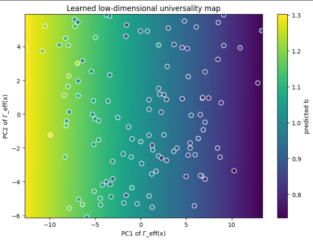

b ≈ LearnedModel[Γ_eff(x)]

- Low-dimensional embedding (PCA)  
- Smooth, structured mapping  
- Predictive across protocols  

---

## Analytic Approximation

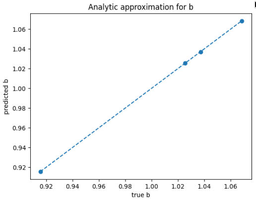

b ≈ α + β⟨|Γ'|⟩ + γ⟨|Γ''|⟩ + δ·CV  

- Interpretable features  
- Matches fitted values  

---

## First-Principles Derivation

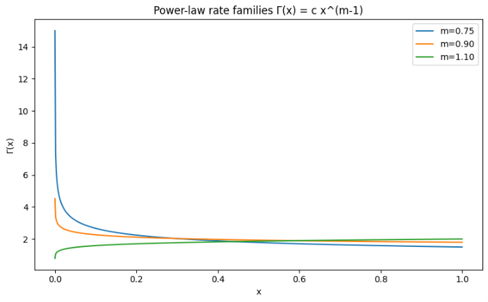  
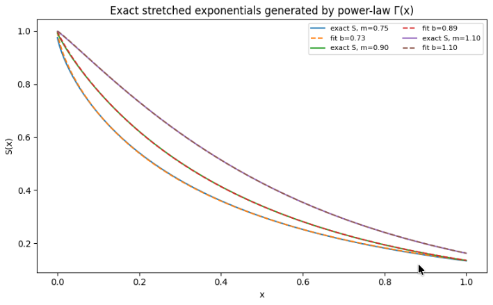

Starting from:

S(x) = exp(−∫ Γ(u) du)

If:

Γ(x) = c x^(m−1)

Then:

S(x) = exp(−(c/m) x^m)

→ exact stretched exponential (b = m)

---

## Local Exponent Field

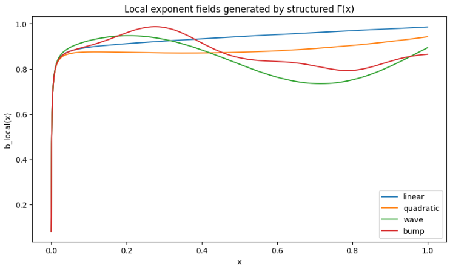

b_local(x) = x Γ(x) / ∫ Γ  

- Constant for power-law Γ  
- Scale-dependent for structured Γ  

> The exponent is not a number — it is a **field over scale**

---

## Global Exponent as Projection

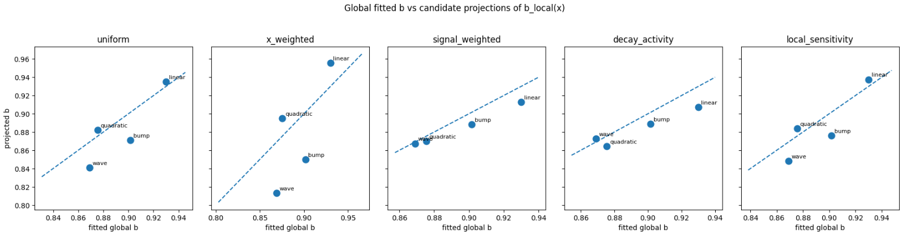

b ≈ ∫ w(x) b_local(x) dx  

- Different weights → different b  
- Global exponent depends on scale emphasis  

---

### Best-fit projection

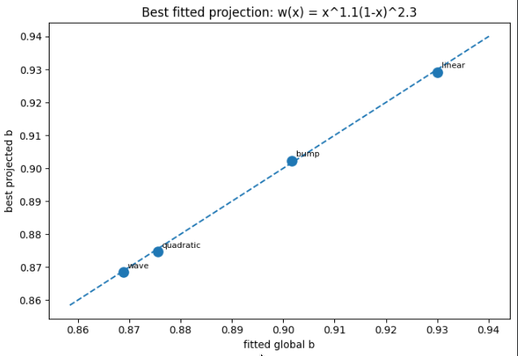

w(x) ≈ x^1.1 (1−x)^2.3  

- Emphasizes intermediate scales  
- Reproduces fitted b with high accuracy  

---

## Interpretation

> The stretched exponent is not a fit parameter.  
> It is a **compressed summary of a scale-dependent exponent field**.

Full hierarchy:

Γ(x)  
→ b_local(x)  
→ weighted projection  
→ global exponent b  

---

## Physical Model

H = (Ω/2) σ_x − Δ |r⟩⟨r|  

H = Σ_i [(Ω/2) σ_x^(i) − Δ n_i] + V n₁ n₂  

dρ/dt = −i[H, ρ] + Σ_k (L_k ρ L_k† − ½ {L_k† L_k, ρ})

Noise:
- γ (decay)  
- γ_φ (dephasing)  

---

## Workflows

- Lindblad simulation  
- Parameter sweeps  
- CZ gate construction  
- Scaling-law extraction  
- Universality modeling  

---

## Repository Structure

rydberg-parameter-lab/  
├── README.md  
├── notebooks/  
├── src/  
├── figures/  
└── environment.yml  

---

## Installation

pip install -r requirements.txt  

or  

conda env create -f environment.yml  
conda activate rydberg-parameter-lab  

---

## Dependencies

- Python 3.10+  
- NumPy  
- SciPy  
- Matplotlib  
- QuTiP  

---

## Research Direction

- Structure in noisy quantum systems  
- Dynamical universality  
- Effective-rate geometry  
- Scaling laws beyond exponentials  

---

## License

MIT License
