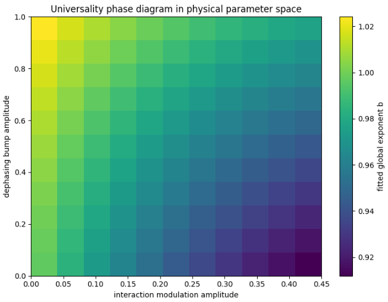
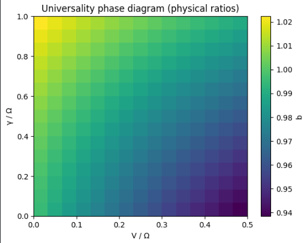
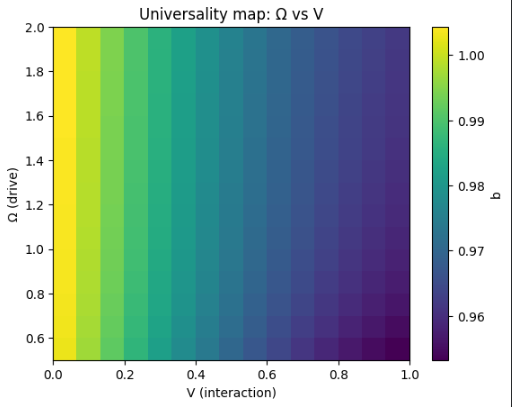
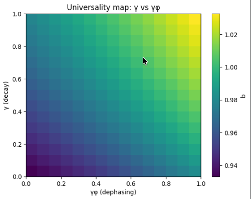
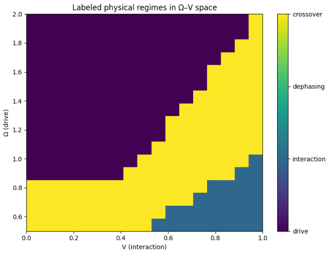
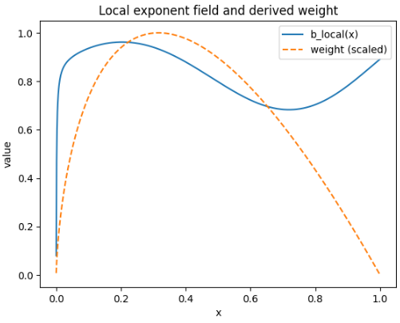

# rydberg-parameter-lab

**From Lindblad dynamics → structured rate processes → universal scaling laws**

---

## Key Results

- Emergence of an **effective noise coordinate**  
  γ_eff = γ + λ·γ_φ  

- Identification of a **controlled breakdown of 1D scaling**

- Recovery via a **low-dimensional (2D) model**

- Discovery of a **scale-dependent decay rate Γ_eff(x)**

- Derivation of **stretched-exponential universality**

- Identification of a **local exponent field**  
  b_local(x) = x Γ(x) / ∫₀ˣ Γ(u)

- Final result: **global exponent as projection**
  
  b ≈ ∫ w(x) b_local(x) dx  

- **Projection weight derived from fit sensitivity**
  
  w(x) ∝ |∂ log S(x) / ∂ b|

---

## Overview

This project studies **noise-affected Rydberg CZ gates** and reveals hidden structure in open-system quantum dynamics.

Core shift:

> Dynamics are governed by a **structured, scale-dependent rate process Γ(x)**,  
> not a constant decay rate.

---

## Emergent Effective Noise Coordinate

γ_eff = γ + λ·γ_φ  

- Defines dominant noise direction  
- Enables approximate dimensionality reduction  

---

## Breakdown of 1D Scaling

- Alignment fails systematically  
- Deviations are structured, not noise  

---

## Low-Dimensional Model Recovery

- Near-perfect prediction  
- System is low-dimensional, but not strictly 1D  

---

## Emergent Scale-Dependent Rate

dS/dx = −Γ_eff(x) · S  

- Γ_eff(x) varies across scale  
- Encodes the true dynamics  

---

## Stretched-Exponential Universal Law

S(x) ≈ exp(−a x^b)

- Pure exponential fails  
- Stretched exponential captures behavior  
- Exponent b varies across protocols  

---

## Universality Phase Diagram (Physical Parameter Space)

Sweeping physical parameters reveals:

b = f(dephasing, interaction)

- increasing interaction → lowers b  
- increasing dephasing → raises b  

→ the stretched exponent becomes a **physical observable**

---

## Universality Phase Diagram (Physical Control Ratios)

Rewriting in experimental ratios:

b = f(γ/Ω, V/Ω)

- γ/Ω ↑ → b ↑ (smoother decay)  
- V/Ω ↑ → b ↓ (structured decay)  

---

## Universality Phase Diagram (Full Physical Parameters)

Mapping:

(Ω, Δ, V, γ, γ_φ) → b

reveals:

- drive vs interaction competition  
- decay vs dephasing competition  

> Universality is directly controlled by physical parameters.

---

## Labeled Universality Regimes

The universality map partitions into:

- **Drive-dominated**
- **Interaction-dominated (Rydberg blockade)**
- **Dephasing-influenced**
- **Crossover**

> The exponent b becomes a **coordinate on a physical phase diagram**

---

## Functional Universality

b = Functional[Γ_eff(x)]

- Scalar summaries fail  
- Structure determines behavior  

---

## Learned Universality Mapping

b ≈ LearnedModel[Γ_eff(x)]

- Low-dimensional embedding  
- Smooth predictive mapping  

---

## Analytic Approximation

b ≈ α + β⟨|Γ'|⟩ + γ⟨|Γ''|⟩ + δ·CV  

- Interpretable  
- Matches data  

---

## First-Principles Derivation

  

If:

Γ(x) = c x^(m−1)

Then:

S(x) = exp(−(c/m) x^m)

→ exact stretched exponential (b = m)

---

## Local Exponent Field

b_local(x) = x Γ(x) / ∫ Γ  

- constant for power-law Γ  
- variable for structured Γ  

> The exponent is a **field over scale**

---

## Global Exponent as Projection

b ≈ ∫ w(x) b_local(x) dx  

- depends on scale weighting  
- not a single-scale property  

---

## Sensitivity-Derived Projection Weight

From:

S(x) = exp(−a x^b)

we obtain:

∂ log S / ∂ b = −a x^b log x  

→

w(x) ∝ x^b |log x|

---

### Interpretation

- small x suppressed  
- large x suppressed  
- **intermediate x dominates**

→ exponent emerges from a **specific scale window**

---

### Best-fit projection

w(x) ≈ x^1.1 (1−x)^2.3  

- matches empirical fits  
- selects dominant scale region  

---

## Interpretation

> The stretched exponent is not a fit parameter.  
> It is a **compressed summary of a scale-dependent exponent field**.

Hierarchy:

Γ(x)  
→ b_local(x)  
→ sensitivity-weighted projection  
→ b  

---

## Physical Model

H = (Ω/2) σ_x − Δ |r⟩⟨r|  

H = Σ_i [(Ω/2) σ_x^(i) − Δ n_i] + V n₁ n₂  

dρ/dt = −i[H, ρ] + Σ_k (L_k ρ L_k† − ½ {L_k† L_k, ρ})

Noise:
- γ  
- γ_φ  

---

## Workflows

- Lindblad simulation  
- Parameter sweeps  
- CZ gate construction  
- Scaling-law extraction  
- Universality modeling  

---

## Repository Structure

rydberg-parameter-lab/  
├── README.md  
├── notebooks/  
├── src/  
├── figures/  
└── environment.yml  

---

## Installation

pip install -r requirements.txt  

or  

conda env create -f environment.yml  
conda activate rydberg-parameter-lab  

---

## Dependencies

- Python 3.10+  
- NumPy  
- SciPy  
- Matplotlib  
- QuTiP  

---

## Research Direction

- Structure in noisy quantum systems  
- Dynamical universality  
- Effective-rate geometry  
- Scaling laws beyond exponentials  

---

## License

MIT License
