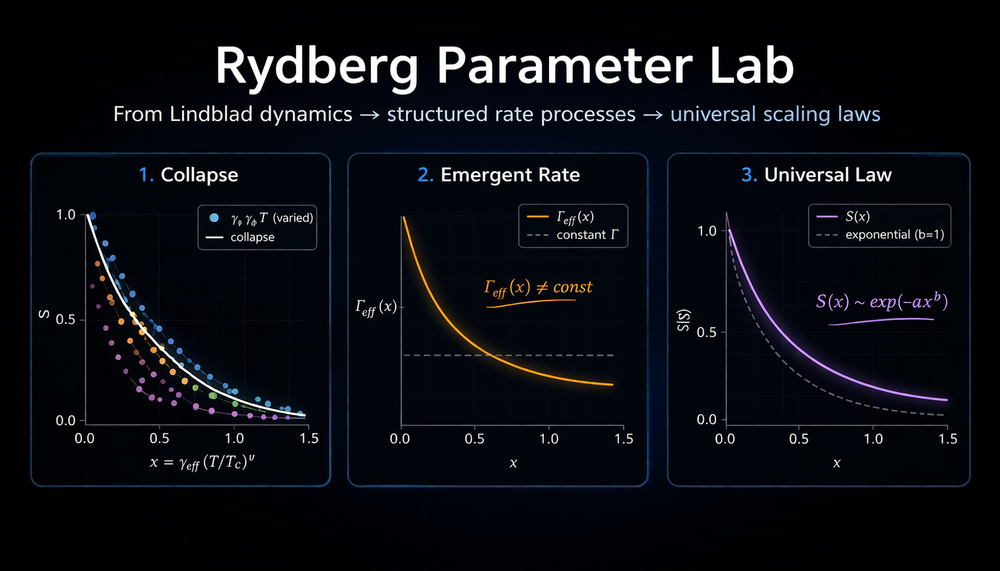
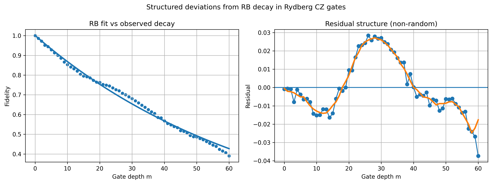
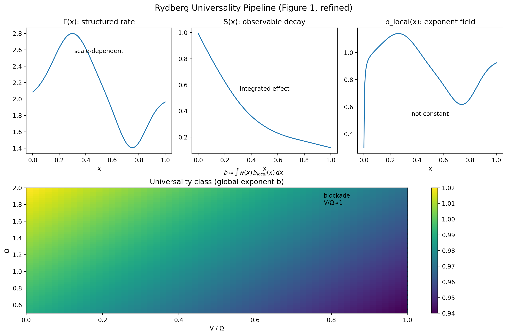
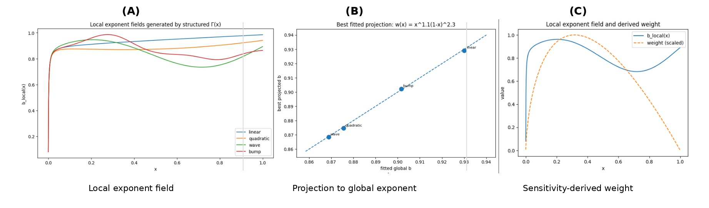
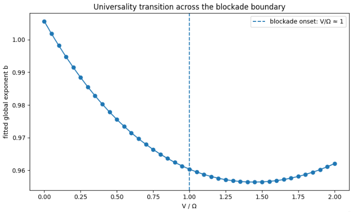

# Rydberg Parameter Lab

**Open-system modeling of neutral-atom CZ gates using Lindblad dynamics, with direct connections to QCVV and noise characterization.**

---

## 📊 Residual Structure (Key Result)



Residual structure beyond RB decay: observed fidelity is well-fit
by an exponential RB model (left), but residuals (right) show clear structure,
indicating coherent or non-Markovian noise not captured by a single decay parameter.

---

## 📄 Summary PDF

👉 **[Download 1-page summary](docs/rydberg_qcvv_residual_structure.pdf)**

A concise explanation of residual structure beyond RB decay and its connection to effective noise modeling.

---

## 🔥 Featured: QCVV + Residual Analysis

This repository includes a focused **QCVV bridge and residual analysis pipeline**:

- **Notebook 64 — QCVV Bridge**
  - Simulates fidelity decay under open-system noise
  - Fits RB model: A p^m + B
  - Demonstrates systematic deviation from exponential decay

- **Notebook 65 — Residual Analysis**
  - Shows structured RB residuals (not random noise)
  - Uses smoothing and FFT to reveal coherent structure
  - Connects deviations to effective noise coordinate γ_eff

👉 These notebooks demonstrate:
> **RB captures average error, but residual structure reveals underlying physics**

---

## 🚀 QuickStart

### QCVV + Residual Analysis (start here)

[](https://colab.research.google.com/github/thinkthoughts/rydberg-parameter-lab/blob/main/notebooks/64_qcvv_bridge.ipynb)

[](https://colab.research.google.com/github/thinkthoughts/rydberg-parameter-lab/blob/main/notebooks/65_qcvv_residual_analysis.ipynb)

---

## Key Contributions

- Modeled CZ gate dynamics under open-system noise (Lindblad master equation)
- Introduced an effective noise coordinate γ_eff = γ + λ γ_φ
- Identified scaling behavior and phase boundaries in noisy gate regimes
- Connected noise models to QCVV-style benchmarking and gate characterization
- Demonstrated structured deviations from RB exponential decay
- Analyzed residual structure to identify coherent and non-Markovian effects

---

## Overview

This repository explores how **noise and control parameters shape fidelity in neutral-atom quantum gates**, with a focus on:

- decoherence (γ, γ_φ)
- gate depth dependence
- deviations from simple exponential decay
- structure in noisy quantum dynamics

---

## Example Behavior



*Example: fidelity decay under increasing gate depth, showing deviation from ideal exponential behavior.*

---

## Full Modeling Pipeline

[](https://colab.research.google.com/github/thinkthoughts/rydberg-parameter-lab/blob/main/notebooks/58_lindblad_to_gamma_pipeline.ipynb)

[](https://colab.research.google.com/github/thinkthoughts/rydberg-parameter-lab/blob/main/notebooks/63_blockade_boundary_transition.ipynb)

---

### Suggested progression

- Notebook 64 — QCVV bridge (RB vs noise model)
- Notebook 65 — residual structure analysis
- Notebook 58 — Lindblad → Γ(x) → S(x)
- Notebook 59–61 — universality phase diagrams
- Notebook 62 — labeled regimes
- Notebook 63 — blockade transition

---

## Key Results

- Effective noise coordinate: γ_eff = γ + λ γ_φ  
- Structured deviation from RB exponential decay  
- Residuals contain coherent / non-Markovian structure  
- Breakdown of 1D scaling  
- Recovery via structured Γ(x)  
- Stretched-exponential universality  

---

## Theory Overview

Dynamics are governed by a **structured, scale-dependent rate process Γ(x)**.



---

## Blockade Boundary and Universality Transition



V / Ω ≈ 1 marks the Rydberg blockade onset.

---

## Interpretation

Randomized benchmarking compresses gate behavior into a single decay parameter p.

However, in this system:

- residuals are structured, not random  
- deviations are systematic  
- noise contains coherent and scale-dependent components  

> **Residual structure is signal, not noise.**

---

## Physical Model

H = (Ω/2) σ_x − Δ |r⟩⟨r|  

H = Σ_i [(Ω/2) σ_x^(i) − Δ n_i] + V n₁ n₂  

dρ/dt = −i[H, ρ] + Σ_k (L_k ρ L_k† − ½ {L_k† L_k, ρ})

---

## Installation

```bash
pip install -r requirements.txt
