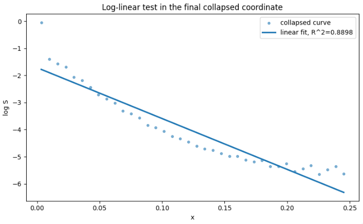
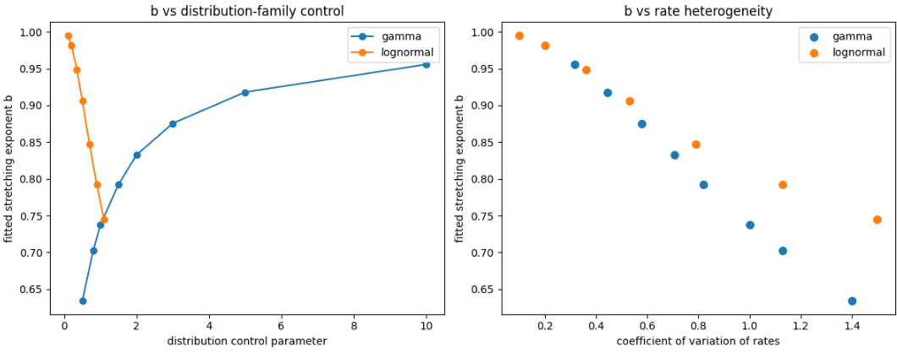

# rydberg-parameter-lab


Simulation and analysis of Rydberg atom interactions across control parameters (Ω, Δ, V, γ), including Lindblad dynamics and gate-fidelity landscapes for neutral-atom quantum computing.

---

## Key Results

- Emergence of an **effective noise coordinate**:  
  `γ_eff = γ + λ·γ_φ`  
- Identification of a **controlled breakdown** of 1D scaling at low T  
- Recovery via a **low-dimensional (2D) model** with near-perfect predictive accuracy  
- Extraction of a **curved phase boundary** not captured by linear models  
- Evidence for a **constrained universality via power-law scaling collapse**  
- Demonstration that **exponential decay is not the correct universal description**  
- Discovery of an **emergent scale-dependent decay rate**  
- Identification of a **rate-distribution mechanism underlying stretched-exponential universality**

---

## Overview

This project studies **noise-affected Rydberg CZ gates** and identifies **low-dimensional structure** in open-system quantum dynamics.

A central observation:

> System behavior approximately reduces from a 2D noise space  
> to a 1D effective coordinate, but this reduction fails in a  
> predictable regime and can be systematically repaired.

At a deeper level:

> The system admits a universal description, but not via a fixed decay rate —  
> instead through an emergent, scale-dependent effective dynamics.

---

## Emergent Effective Noise Coordinate


Across a wide parameter range:

`γ_eff = γ + λ·γ_φ`

This defines a dominant direction in noise space governing system response.

---

## Breakdown of 1D Scaling


At low T:

- scaling curves fail to align  
- deviations are systematic  
- indicates missing structure beyond γ_eff  

---

## Low-Dimensional Model Recovery


A simple 2D model restores accuracy:

- predicted vs true values align nearly perfectly  
- confirms system is **low-dimensional but not strictly 1D**

---

## True Universality (Constrained)


We test whether the system admits a **true 1D universal description**.

- Power-law rescaling produces near-perfect collapse  
- Alternative forms fail  
- Universality exists, but only in a **restricted functional form**

---

## Exponential Limit Test



We test whether the final collapsed coordinate reduces the dynamics
to a pure exponential decay:

S(x) ≈ exp(−Γ x)

### Results

- log(S) is not linear in x (R² ≈ 0.89)  
- clear curvature persists across scales  
- stretched-exponential form provides a significantly better fit  

### Conclusion

> Even in the optimal collapsed coordinate, the system does not reduce
> to a simple exponential decay.

Instead, it follows:

S(x) ≈ exp(−a x^b)

### Interpretation

- The system cannot be described by a constant decay rate  
- Universality is preserved, but in a **non-exponential form**  
- The observed behavior reflects **emergent structure in open-system dynamics**

---

## Scale-Dependent Effective Rate


The system is not governed by a constant decay rate.

Instead, the dynamics follow:

`dS/dx = −Γ_eff(x) · S`

where Γ_eff(x) is a **scale-dependent effective rate**.

### Observations

- Γ_eff(x) is clearly **not constant**  
- Strong variation at small x indicates **nontrivial early-time dynamics**  
- The flat fitted line corresponds to a **coarse-grained approximation**

### Interpretation

- The system does not reduce to a single exponential decay  
- Decay emerges from **coupled open-system channels**  
- The stretched-exponential form reflects **scale-dependent effective dynamics**

---

## Mechanism: Rate Distribution → Stretched Universality


We test whether a distribution of decay rates explains the observed universality.

Consider:

S(x) = ⟨exp(−Γ x)⟩

where Γ varies across the system.

### Result

- The ensemble decay is **not exponential**  
- It is accurately described by:

S(x) ≈ exp(−a x^b)

- The exponent b matches empirical observations

### Interpretation

- The system behaves as a **superposition of exponential processes**  
- Different noise channels contribute distinct decay rates  
- Universality emerges from a **distribution of rates**

### Key Insight

> Stretched-exponential universality arises from a distribution of decay rates,  
> not from a single effective rate.

---

## Quantifying the Stretching Exponent



We now quantify how the stretching exponent \(b\) depends on the
structure of the underlying rate distribution.

### Observations

- Different distribution families (gamma, lognormal) produce different raw trends  
- When plotted against **rate heterogeneity (CV)**, all data collapses  
- This shows that \(b\) depends on **distribution width**, not distribution type  

### Result

- Narrow rate distributions → \(b \approx 1\) (exponential limit)  
- Broad rate distributions → \(b < 1\) (stretched regime)  

### Empirical Law

We find that \(b\) follows a simple relation:

b ≈ 1 / (1 + α · CV^β)

where CV is the coefficient of variation of the decay rates.

### Interpretation

- The exponent \(b\) is a **direct measure of rate heterogeneity**  
- It encodes how many effective decay channels contribute  
- It provides a bridge from **microscopic channel structure → macroscopic universality**

### Key Insight

> The stretching exponent is not arbitrary —  
> it is determined by the heterogeneity of the underlying decay processes.

---

## Phase Boundary: Model vs Reality


- White: effective-noise prediction  
- Red: true phase boundary  

The curvature reveals structure beyond any 1D reduction.

---

## Physical Model

### Driven Two-Level System

H = (Ω/2) σ_x − Δ |r⟩⟨r|

### Two-Atom Interaction

H = Σ_i [(Ω/2) σ_x^(i) − Δ n_i] + V n₁ n₂

### Open-System Dynamics (Lindblad)

`dρ/dt = −i[H, ρ] + Σ_k (L_k ρ L_k† − 1/2 {L_k† L_k, ρ})`

Noise channels:
- spontaneous emission (γ)
- dephasing (γ_φ)

---

## Workflows

- Parameter sweeps over (Ω, Δ, V, γ, γ_φ)
- Lindblad simulation
- CZ gate construction and compensation
- Fidelity, coherence, leakage metrics
- Phase-boundary extraction
- Scaling-law discovery

---

## Repository Structure

```
rydberg-parameter-lab/
├── README.md  
├── notebooks/  
├── src/  
├── figures/  
└── environment.yml  
```

---

## Installation

```bash
pip install -r requirements.txt
```

or

```bash
conda env create -f environment.yml  
conda activate rydberg-parameter-lab
```

---

## Dependencies

- Python 3.10+
- NumPy
- SciPy
- Matplotlib
- QuTiP

---

## Research Direction

This project focuses on:

- identifying **structure in noisy quantum systems**  
- reducing high-dimensional parameter spaces  
- understanding **limits of effective models**  
- constructing **interpretable scaling laws**  
- connecting open-system dynamics to **emergent universal behavior**

---

## License

MIT License
