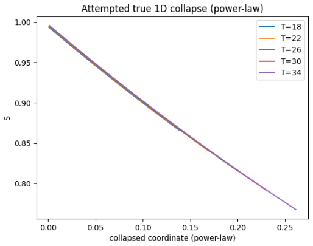
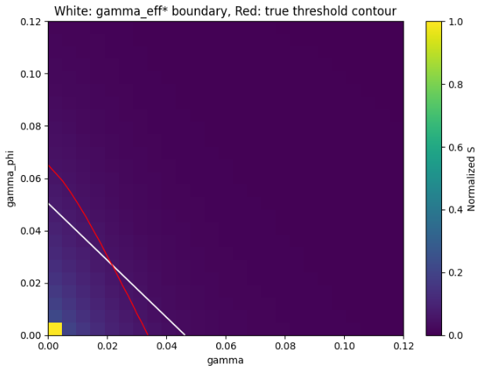

# rydberg-parameter-lab

Simulation and analysis of Rydberg atom interactions across control parameters (Ω, Δ, V, γ), including Lindblad dynamics and gate-fidelity landscapes for neutral-atom quantum computing.

---

## Key Results

- Emergence of an **effective noise coordinate**:
  γ_eff = γ + λ·γ_φ  
- Identification of a **controlled breakdown** of 1D scaling at low T  
- Recovery via a **low-dimensional (2D) model** with near-perfect predictive accuracy  
- Extraction of a **curved phase boundary** not captured by linear models  
- Evidence for a **constrained universality via power-law scaling collapse**  
- Discovery of an **emergent scale-dependent decay rate**, replacing simple factorized noise models  

---

## Overview

This project studies **noise-affected Rydberg CZ gates** and identifies **low-dimensional structure** in open-system quantum dynamics.

A central observation:

> System behavior approximately reduces from a 2D noise space  
> to a 1D effective coordinate, but this reduction fails in a  
> predictable regime and can be systematically repaired.

At a deeper level:

> The system admits a universal description, but not via a fixed decay rate —
> instead through an emergent, scale-dependent effective dynamics.

---

## Emergent Effective Noise Coordinate

Across a wide parameter range:

γ_eff = γ + λ·γ_φ

This defines a dominant direction in noise space governing system response.

---

## Breakdown of 1D Scaling

At low T:

- scaling curves fail to align  
- deviations are systematic  
- indicates missing structure beyond γ_eff  

---

## Low-Dimensional Model Recovery

A simple 2D model restores accuracy:

- predicted vs true values align nearly perfectly  
- confirms system is **low-dimensional but not strictly 1D**

---

## True Universality (Constrained)

We test whether the system admits a **true 1D universal description**.

- Power-law rescaling produces near-perfect collapse  
- Alternative forms fail  
- Universality exists, but only in a **restricted functional form**

---

## Emergent Rate Model (New Result)

The universal response is not governed by a constant decay rate.

Instead:

dS/dx = −Γ_eff(x) · S

where Γ_eff(x) is **scale-dependent**.

This leads naturally to a stretched form:

S(x) ≈ exp(−a x^b)

Key implications:

- decay is not factorizable into independent channels  
- effective dynamics evolve across scale  
- stretched behavior emerges from **coupled open-system processes**

---

## Phase Boundary: Model vs Reality

- White: effective-noise prediction  
- Red: true phase boundary  

The curvature reveals structure beyond simple reductions.

---

## Physical Model

### Driven Two-Level System

H = (Ω/2) σ_x − Δ |r⟩⟨r|

### Two-Atom Interaction

H = Σ_i [(Ω/2) σ_x^(i) − Δ n_i] + V n₁ n₂

### Open-System Dynamics (Lindblad)

dρ/dt = −i[H, ρ] + Σ_k (L_k ρ L_k† − 1/2 {L_k† L_k, ρ})

Noise channels:
- spontaneous emission (γ)
- dephasing (γ_φ)

---

## Workflows

- Parameter sweeps over (Ω, Δ, V, γ, γ_φ)
- Lindblad open-system simulation
- CZ gate construction and compensation
- Fidelity, coherence, leakage metrics
- Phase-boundary extraction
- Scaling-law discovery

---

## Repository Structure

rydberg-parameter-lab/
├── README.md  
├── notebooks/  
├── src/  
├── figures/  
└── environment.yml  

---

## Installation

pip install -r requirements.txt

or

conda env create -f environment.yml  
conda activate rydberg-parameter-lab  

---

## Dependencies

- Python 3.10+
- NumPy
- SciPy
- Matplotlib
- QuTiP

---

## Research Direction

This project focuses on:

- identifying **structure in noisy quantum systems**  
- reducing high-dimensional parameter spaces  
- understanding **limits of effective models**  
- constructing **interpretable scaling laws**  
- connecting open-system dynamics to **emergent universal behavior**

---

## License

MIT License
