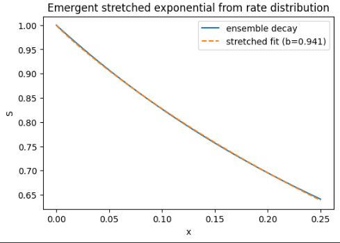
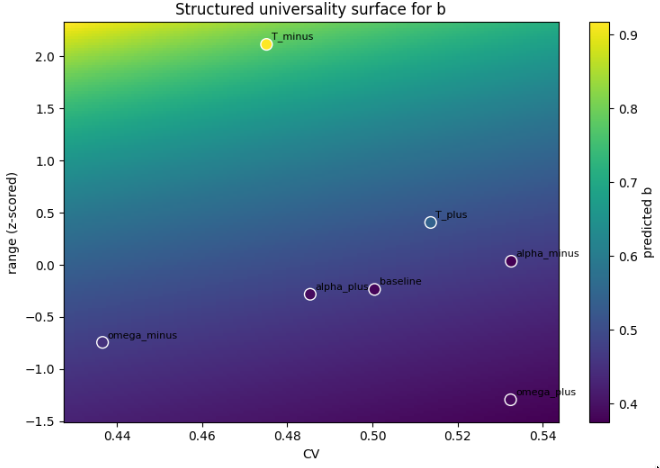

# rydberg-parameter-lab

**From Lindblad dynamics → structured rate processes → universal scaling laws**

---

## Key Results

- Emergence of an **effective noise coordinate**:  
  γ_eff = γ + λ·γ_φ  
- Identification of a **controlled breakdown of 1D scaling** at low T  
- Recovery via a **low-dimensional (2D) model** with near-perfect predictive accuracy  
- Extraction of a **curved phase boundary** beyond linear effective-noise models  
- Evidence for **constrained universality via power-law scaling alignment**  
- Discovery of an **emergent scale-dependent decay rate Γ_eff(x)**  
- Derivation of a **stretched-exponential universal response law**  
- Identification of a **dynamical universality class**:

  b = f(CV, structure of Γ_eff(x))

---

## Overview

This project studies **noise-affected Rydberg CZ gates** and identifies **low-dimensional structure** in open-system quantum dynamics.

A central observation:

System behavior approximately reduces from a 2D noise space  
to a 1D effective coordinate, but this reduction fails in a  
predictable regime and can be systematically repaired.

Deeper structure:

The system admits a universal description,  
not via a constant decay rate,  
but through a structured, scale-dependent rate process.

---

## Emergent Effective Noise Coordinate

γ_eff = γ + λ·γ_φ  

- Defines dominant direction in noise space  
- Enables approximate dimensionality reduction  

---

## Breakdown of 1D Scaling

- Alignment fails at low T  
- Deviations are systematic (not noise)  
- Indicates missing structure beyond γ_eff  

---

## Low-Dimensional Model Recovery

- Near-perfect prediction  
- Confirms system is **low-dimensional but not strictly 1D**

---

## True Universality (Constrained)

- Power-law rescaling produces strong alignment  
- Additive corrections fail  
- Universality exists, but only in a **restricted functional form**

---

## Emergent Scale-Dependent Rate

dS/dx = −Γ_eff(x) · S

- Γ_eff(x) is not constant  
- Strong variation at small x  
- Defines underlying dynamics  

---

## Stretched-Exponential Universal Law

S(x) ≈ exp(−a x^b)

**Best-fit exponent:** b ≈ 0.99 (baseline case)

### Observations

- Pure exponential (b = 1) fails  
- Stretched exponential captures the full decay  
- The exponent b varies systematically across protocols  

### Connection to Structure

- The near-unity value b ≈ 0.99 corresponds to **low heterogeneity / structured rate dynamics**
- Deviations in b across protocols are explained by:
  
  b = f(CV, structure of Γ_eff(x))

→ This directly motivates the **Dynamical Universality Class** section below

- Pure exponential (b = 1) fails  
- Stretched exponential succeeds  
- b varies by protocol  

---

## From Rate Distributions to Universality

- Arises from mixtures of decay rates  
- Reflects heterogeneous effective dynamics  

---

## Dynamical Universality Class

b = f(CV, structure of Γ_eff(x))

### Key Findings

- CV-only models fail systematically  
- Structured rate features resolve mismatch  
- Universality depends on dynamics, not just disorder  

### Interpretation

- System belongs to a **dynamical universality class**  
- Governed by:
  - statistical variation (CV)
  - dynamical structure (Γ_eff)

---

## Functional Universality of Decay Dynamics

The stretching exponent b is not determined by a single scalar (e.g., CV).

Instead:

b = Functional[Γ_eff(x)]

### Key observations

- Different shapes of Γ_eff(x) produce different b  
- Even with similar rate heterogeneity (CV), b varies  
- Structural features (slope, curvature, range) jointly determine behavior  

### Interpretation

- Universality is governed by the **structure of the effective-rate process**
- The system belongs to a **functional universality class**, not just a statistical one

---

## Learned Universality Map

We learn a predictive mapping from the effective-rate process Γ_eff(x) to the
stretched-exponential exponent b.

The mapping is constructed using a low-dimensional representation (PCA) of Γ_eff(x).

### Interpretation

- Each point corresponds to a full effective-rate process Γ_eff(x)  
- The axes (PC1, PC2) represent dominant modes of variation:
  - PC1: global slope / trend  
  - PC2: curvature / modulation  
- Color encodes the predicted stretching exponent b  

### Key observations

- b varies smoothly across the low-dimensional manifold  
- The mapping is structured and continuous  
- Scalar summaries (e.g. CV) are insufficient  

### Conclusion

> The stretching exponent is not just a fit parameter —  
> it is a **learnable function of the effective-rate process**.

This establishes a predictive form of universality:

b ≈ LearnedModel[Γ_eff(x)]

---

## Phase Boundary: Model vs Reality

- Curvature reveals higher-order structure  

---

## Physical Model

H = (Ω/2) σ_x − Δ |r⟩⟨r|

H = Σ_i [(Ω/2) σ_x^(i) − Δ n_i] + V n₁ n₂

dρ/dt = −i[H, ρ] + Σ_k (L_k ρ L_k† − 1/2 {L_k† L_k, ρ})

Noise:
- γ (decay)
- γ_φ (dephasing)

---

## Workflows

- Parameter sweeps  
- Lindblad simulation  
- CZ gate construction  
- Fidelity / coherence / leakage  
- Scaling-law extraction  
- Universality fitting  

---

## Repository Structure

rydberg-parameter-lab/  
├── README.md  
├── notebooks/  
├── src/  
├── figures/  
└── environment.yml  

---

## Installation

pip install -r requirements.txt  

or  

conda env create -f environment.yml  
conda activate rydberg-parameter-lab  

---

## Dependencies

- Python 3.10+
- NumPy
- SciPy
- Matplotlib
- QuTiP

---

## Research Direction

- Structure in noisy quantum systems  
- Dimensionality reduction  
- Limits of effective models  
- Universal scaling laws  
- Dynamical universality classes  

---

## License

MIT License
