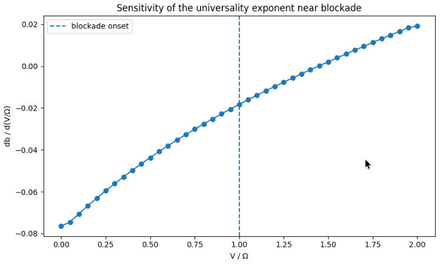
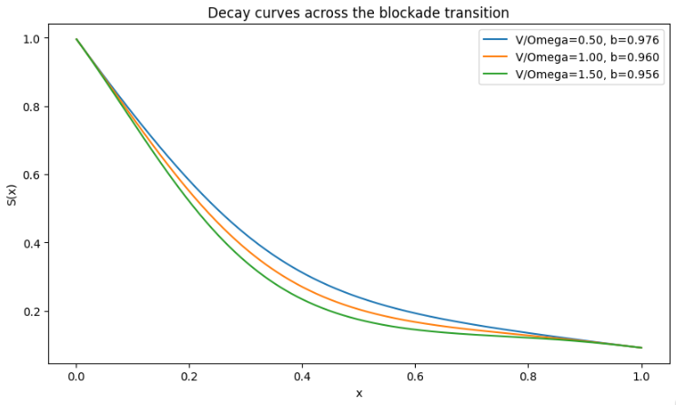
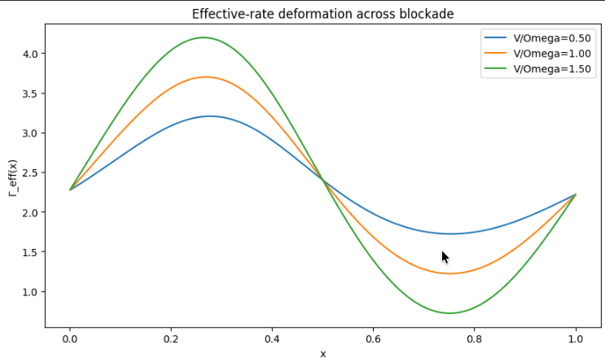
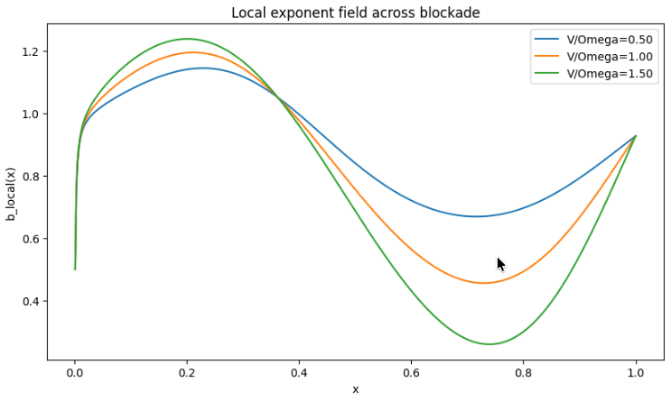
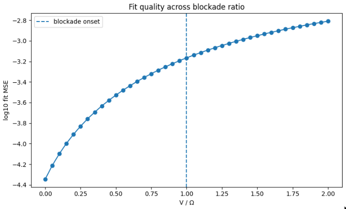

# Rydberg Parameter Lab

**Open-system modeling of neutral-atom CZ gates using Lindblad dynamics, with direct connections to QCVV and noise characterization.**

---

## Key Contributions

- Modeled CZ gate dynamics under open-system noise (Lindblad master equation)
- Introduced an effective noise coordinate (γ_eff) to capture combined decoherence effects
- Identified scaling behavior and phase boundaries in noisy gate regimes
- Generated parameter sweeps over Ω, Δ, V, γ → fidelity landscapes
- Connected noise models to QCVV-style benchmarking and gate characterization

---

## Overview

This repository explores how **noise and control parameters shape fidelity in neutral-atom quantum gates**, with a focus on:

- decoherence (γ, γ_φ)
- gate depth dependence
- deviations from simple exponential decay
- structure in noisy quantum dynamics

---

## Example Behavior

*Example: fidelity decay under increasing gate depth, with interaction parameters (Ω, Δ, V) governing dynamics.*

---

## 🚀 QuickStart

Explore the full pipeline interactively:

**Jump to the physics result (blockade transition):**

---

### Suggested progression

- Notebook 58 — Lindblad → Γ(x) → S(x)  
- Notebook 59–61 — universality phase diagrams  
- Notebook 62 — labeled regimes  
- Notebook 63 — blockade transition  

---

## Key Results

- Effective noise coordinate: γ_eff = γ + λ·γ_φ  
- Breakdown of 1D scaling  
- Recovery via structured Γ(x)  
- Stretched-exponential universality  
- Local exponent field b_local(x)  
- Global exponent as projection  
- Sensitivity-derived projection weight  

---

## Overview

Dynamics are governed by a **structured, scale-dependent rate process Γ(x)**.

---

## Stretched-Exponential Universal Law

S(x) ≈ exp(−a x^b)

---

## Universality Phase Diagrams

b = f(physical parameters)

---

## Functional Universality

b = Functional[Γ_eff(x)]

---

## Learned Mapping

b ≈ LearnedModel[Γ_eff(x)]

---

## Analytic Approximation

---

## Local Exponent Field

b_local(x) = x Γ(x) / ∫ Γ

---

## Global Exponent as Projection

b ≈ ∫ w(x) b_local(x) dx  

---

## Sensitivity-Derived Projection Weight

w(x) ∝ |∂ log S(x) / ∂ b|

---

## Blockade Boundary and Universality Transition

V / Ω ≈ 1 marks the Rydberg blockade onset.

---

## Interpretation

The exponent **b acts as a detector of many-body constraint onset**.

Hierarchy:

V / Ω  
→ Γ(x) deformation  
→ b_local(x) deformation  
→ global exponent shift  

---

## Physical Model

H = (Ω/2) σ_x − Δ |r⟩⟨r|  

H = Σ_i [(Ω/2) σ_x^(i) − Δ n_i] + V n₁ n₂  

dρ/dt = −i[H, ρ] + Σ_k (L_k ρ L_k† − ½ {L_k† L_k, ρ})

---

## Installation

pip install -r requirements.txt  

---

## License

MIT License
